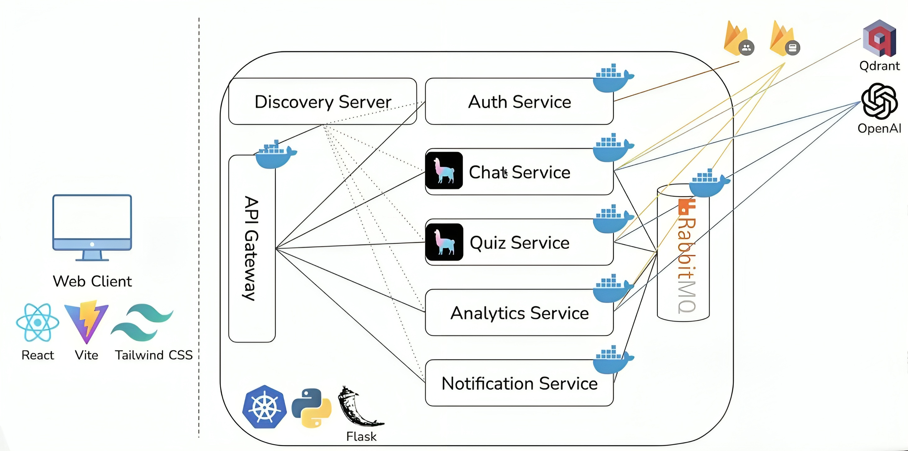

# Quizzy Plus

## Introduction
Quizy Plus is an educational web application designed to assist students in preparing for exams through interactive quizzes and a 24/7 chat assistant. Instead of merely studying from notes or PDFs, students can convert their study material into engaging quizzes. The application offers:

- Document-based question and answer generation.
- A chat assistant that serves as a study buddy.
- Detailed analytics and personalized recommendations based on quiz performance.

## Design Decisions
- Microservices Architecture: The application is divided into several microservices to ensure scalability and maintainability.
- Containerization: All services are containerized using Docker, which simplifies deployment and orchestration.
- Kubernetes: Used for service discovery, registration, and load balancing.
- RabbitMQ: Used as a message broker to handle long-running tasks and maintain the responsiveness of the system.

## Microservices
### Implementation Methods
We used the Netflix software stack for microservices implementation, including Eureka for service discovery, Zuul as the API gateway, and Hystrix for fault tolerance.

### Core Services
#### Chat Service
Functionality: Allows students to upload PDF documents and interact with the chat assistant to clarify doubts.
Endpoints:
- POST /upload: Upload a PDF document.
- POST /chat: Send a chat message.
- DELETE /clearChat: Clear the chat history.
- DELETE /deleteDocument: Delete the uploaded document.
Inter-service Interactions: Communicates with the vector storage and GPT-3.5 model for query processing.

#### Quiz Service
Functionality: Generates multiple-choice and true/false questions from uploaded PDFs.
Endpoints:
- POST /upload: Upload a PDF document.
- POST /generateQuiz: Generate a quiz from the document.
- GET /quiz: Retrieve the generated quiz.
- DELETE /deleteQuiz: Delete a specified quiz.
Inter-service Interactions: Interacts with the analytics service to store quiz results.

#### Analytics Service
Functionality: Provides insights into quiz performance and personalized recommendations.
Endpoints:
- GET /insights: Get performance insights.
- GET /recommendations: Get tailored recommendations.
- GET /results: Retrieve quiz results.
- GET /progress: Track progress over time.
Inter-service Interactions: Consumes data from the quiz service to generate analytics.

### Utility Services
#### Discovery Server
Handles the registration and monitoring of services using Kubernetes.

#### API Gateway
Implemented with Flask, utilizes Kubernetes ingress support to route requests to the relevant services.

#### Authentication Service
Uses Firebase authentication for user management and authorization.

#### Notification Service
Sends email notifications to users when quiz generation is complete.

## User Interface
### Implementation Details
- Front-end: Built using React, Vite, and Tailwind CSS for a responsive and dynamic user interface.
- Back-end: Developed using Python and Flask, containerized with Docker, and orchestrated with Kubernetes.

### API Testing Tools
Postman was used extensively to test all API endpoints and ensure their functionality and reliability.
