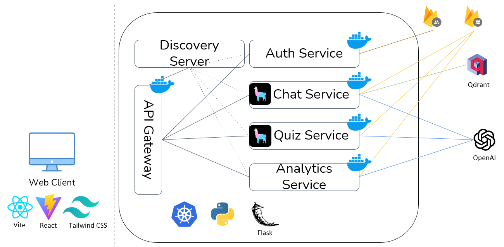

# Quizzy Plus

## Introduction
Quizy Plus is an educational web application designed to assist students in preparing for exams through interactive quizzes and a 24/7 chat assistant. Instead of merely studying from notes or PDFs, students can convert their study material into engaging quizzes. The application offers:

- Document-based question and answer generation.
- A chat assistant that serves as a study buddy.
- Detailed analytics and personalized recommendations based on quiz performance.

## Design Decisions
- Microservices Architecture: The application is divided into several microservices to ensure scalability and maintainability.
- Containerization: All services are containerized using Docker, which simplifies deployment and orchestration.
- Kubernetes: Used for service discovery, registration, and load balancing.
- RabbitMQ: Used as a message broker to handle long-running tasks and maintain the responsiveness of the system.

## Microservices
### Implementation Methods
We used Kubernetes for microservices orchestration, ensuring each service is independently scalable and manageable. Kubernetes handles the deployment, scaling, and operation of application containers across clusters of hosts.

### Core Services
#### Chat Service
Functionality: Allows students to upload PDF documents and interact with the chat assistant to clarify doubts.
Endpoints:
| Method | URL                | Description              | Input Parameters | Input Parameters Formats |
|--------|--------------------|--------------------------|------------------|--------------------------|
| POST   | `/chat/upload`       | Upload document to chat  | file             | File                     |
| POST   | `/chat/query`        | Chat with assistant      | message          | string                   |
| DELETE | `/chat/clear-chat`   | Clear chat history       | -                | -                        |
| DELETE | `/chat/clear-doc`    | Clear uploaded documents | -                | -                        |

Inter-service Interactions: Communicates with the vector storage and GPT-3.5 model for query processing.

#### Quiz Service
Functionality: Generates multiple-choice and true/false questions from uploaded PDFs.

Endpoints:
| Method | URL                | Description              | Input Parameters | Input Parameters Formats |
|--------|--------------------|--------------------------|------------------|--------------------------|
| POST   | `/quiz/gen-qa`       | Upload a document to generate Q&A             | file             | File                     |
| GET    | `/quiz/get-qa`       | Retrieve the generated Q&A                  | -                | -                        |
| DELETE | `/quiz/delete-quiz`  | Delete a specified quiz    | quiz_id          | string                   |
| POST   | `/quiz/store-results`| Store specified quiz results | results        | Array of objects with each object containing 'question' and 'score' |

Inter-service Interactions: Interacts with the analytics service to store quiz results.

#### Analytics Service
Functionality: Provides insights into quiz performance and personalized recommendations.

Endpoints:
| Method | URL                     | Description                   | Input Parameters | Input Parameters Formats |
|--------|-------------------------|-------------------------------|------------------|--------------------------|
| GET    | `/analytics/analyze`      | Get insights from results     | -                | -                        |
| POST   | `/analytics/analyze-by-quiz` | Get insights from a specific quiz | quiz_id         | string                   |
| POST   | `/analytics/get-score`    | Get all results               | -                | -                        |
| DELETE | `/analytics/get-score-by-quiz` | Get results for a specific quiz | quiz_id         | string                   |

Inter-service Interactions: Consumes data from the quiz service to generate analytics.

### Utility Services
#### Discovery Server
- Handles the registration and monitoring of services using Kubernetes.

#### API Gateway
- Implemented with Flask, uses Kubernetes ingress support to route requests to the relevant services.

#### Authentication Service
- Uses Firebase authentication for user management and authorization.

#### Notification Service
- Sends email notifications to users when quiz generation is complete.

## User Interface
### Implementation Details
- Front-end: Built using React, Vite, and Tailwind CSS for a responsive and dynamic user interface.
- Back-end: Developed using Python and Flask, containerized with Docker, and orchestrated with Kubernetes.

### API Testing Tools
- Postman was used extensively to test all API endpoints and ensure their functionality and reliability.

## Deployment
### Local Deployment
1. Clone the repository.
2. Install Docker and Kubernetes on your local machine.
3. Use Docker Compose to start all services.
4. Access the application via localhost.

### Cloud Deployment
1. Choose a cloud provider (e.g., AWS, GCP, Azure).
2. Set up a Kubernetes cluster.
3. Deploy the Docker containers to the cluster.
4. Configure the Kubernetes ingress to expose the API gateway.

## Source Code
### Development Challenges
1. Inconsistent answers from open-source models: Ensuring reliable responses required thorough testing and fine-tuning.
2. Learning new technologies: Adopting new frameworks and tools such as Kubernetes and RabbitMQ posed a learning curve.
3. Setting up & configuring RabbitMQ: Configuring RabbitMQ for efficient message brokering involved significant setup and troubleshooting.

**References**
- F. Tapia, M. Á. Mora, W. Fuertes, H. Aules, E. Flores, and T. Toulkeridis, “From Monolithic Systems to Microservices: A Comparative Study of Performance,” Applied Sciences, vol. 10, no. 17, p. 5797, Aug. 2020, doi: https://doi.org/10.3390/app10175797.
- freeCodeCamp.org, “Microservice Architecture and System Design with Python & Kubernetes – Full Course,” YouTube, Nov. 08, 2022. https://www.youtube.com/watch?v=hmkF77F9TLw&t=4980s.
- “Tutorials,” Kubernetes. https://kubernetes.io/docs/tutorials/
- Docker, “Overview of Docker Compose,” Docker Documentation, Feb. 10, 2020. https://docs.docker.com/compose/
- “RabbitMQ Documentation | RabbitMQ,” www.rabbitmq.com. https://www.rabbitmq.com/docs
- “Installation: Tailwind CLI - Tailwind CSS,” tailwindcss.com. https://tailwindcss.com/docs/installation
